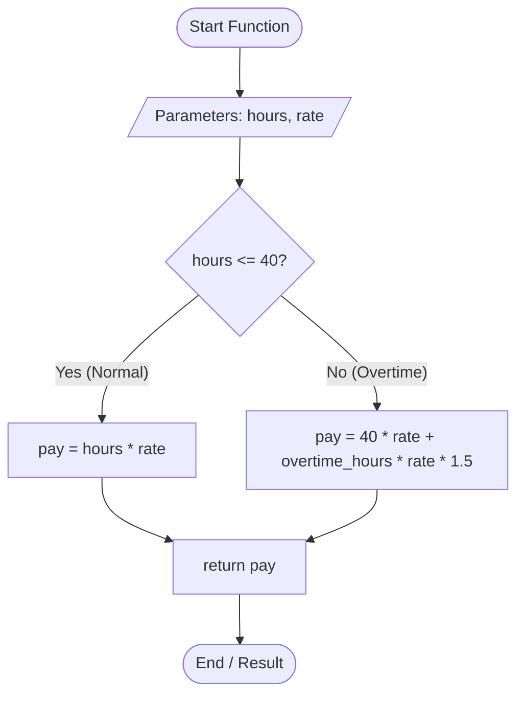

# Logic Flow: Compute Pay Function

## Test Scenarios 3BVA:

* **Scenario 1 (Boundary):** Exactly 40 hours

* **Scenario 2 (Normal):** Less than 40 hours

* **Scenario 3 (Overtime):** More than 40 hours

