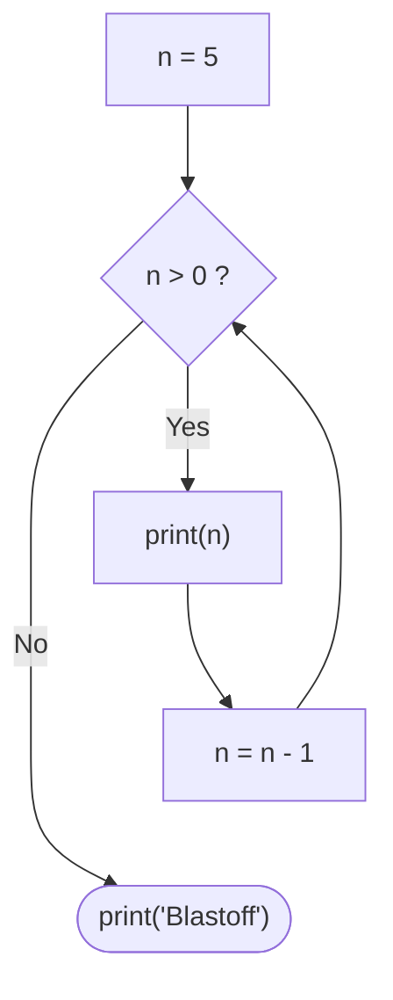
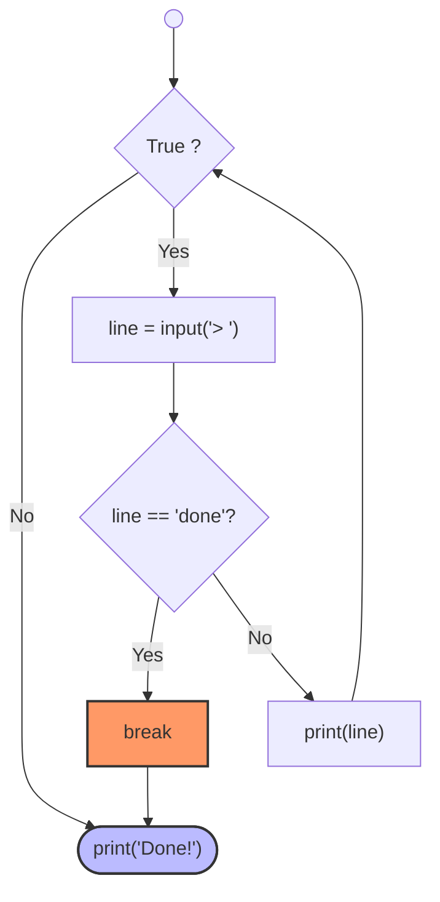

# 🐍 How Python repeats statements using looping structures

## Repeated Steps
* Loops have iteration variables that change each time through a loop. 
* Often these iteration variables go through a sequence of number.
* Be aware of an Infinite Loop (n = 5 while n > 0) or Loop than never will be done (n = 0 while n > 0).
---

Program: 
```python
n = 5
while n > 0 :
   print(n)
   n = n - 1
print('Blastoff!')
print(n)


```
---
Flowchart:


---
## Breaking Out of a Loop
* The break statement ends the current loop and jumps to the statement immediately following the loop.
* It's like a loop test that can happen anywhere in the body of the loop.

Program: 
```python
while True: 
    line = input('> ')
    if line == 'done' :
        break
    print(line)
print('Done!')
```
---
Flowchart:


---
## Finishing an iteration with continue
* The *continue* statement ends the current iteration and jumps to the *top of the loop* and starts the next iteration.
---
Program: 
 ```python
while True: 
    line = input('> ')
    if line[0] == '#':
        continue
    if line == 'done':
        break
    print(line)
print('Done! ')
```
---
## Indefinite Loops
* While loops are called **"indefinite loops"** because they keep going until a logical condition becomes ***False***.
* The loops are pretty easy to examine to see if they will terminate or if they will be "infinite loops".
* sometimes it's a little harder to bu sure if a loop will terminate.

--- 
### Definite Loops
* Quite often we have a *list* of items of the *lines in a file* - effectively a *finite set* of things.
* We can write a loop to run the loop once for each of the items in a set using the Python **for** constuct.
* These loops are called *"definite loops"* because they execute an exact number of times.
* We say that *"definite loops iterate through the members of a set"*.
---
## A Simple Definite Loop
* Definite loops (for loops) have explisit *iteration variables* that change each time through a loop.
* These *iteration variables* move through the sequence or set.
```python
for i in [5, 4, 3, 2, 1]:
    print(1)
print('Blastoff!')
```
---
Program A Definite Loop  with Strings
```python
friends = ['Joseph', 'Glenn', 'Sally']
for friend in friends:
    print('Happy New Year:', friend)
print('Done!')

```
---
## Looking at **in**...
* The *iteration variable* "iterates" through the **sequence** (ordered set)".
* The *block (body)* of code is executed once for each value in the sequence.
* The *iteration variable* moves through all of the values in the sequence.
---


## Making "smart" loops
* The trick is "knowing" something about the whole loop when you are stuck writing code that only sees one entry at a time.
* Set some variables to initial values.
* for thing in data: look for something or do something to each entry separately, updating a variable.
* Look at the variables.


