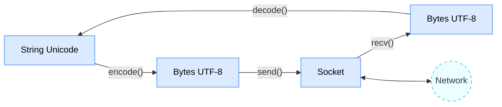

# Characters, ASCII & Unicode

## ASCII 
* Upper and lower letters are different characters
* For letters only Latin
* Each character is represented by a number between 0 and 256 stored in 8 bits memory
* We refer to "8 bits of memory as a "byte" of memory
* The ord() function tells us the numeric value of a simple ASCII character

```python
>>> print(ord('H'))
72
>>> print(ord('e'))
101
>>> print(ord('\n'))
10
```
* Lowercase E is higher that uppercase H because in the simplest of sorts we sort them numerically
---

## Unicode 

> [Unicode site](https://unicode.org/charts/)
---
* To represent the wide range of characters computers must handle we represent characters with more than one byte
* UTF-16 - fixed length - Two bytes
* UTF-32 - fixed length - Four bytes
* UTF - dynamic length - 1-4 bytes
   * Upwards compatible with ASCII
   * Automatic detection between ASCII and UTF-8
   * UTF-8 is recommended practice for encoding data to be exchanged between systems (compression)
   * In Python 3, all strings are internally Unicode
   * Working with string variables in Python programs are reading data from files usually "just works"
   * When we talk to a network resource using sockets or talk to a database we have to encode and decode data (usually to UTF-8)

  ## Python Strings to Bytes
  * When we talk to an external resource like a network socket we sends bytes, so we need to encode Python 3 strings into a given character encoding
  * When we read data from an external resource, wee must decode it based on the character set so it is properly represented in Python 3 as a string
```python
while True: 
   data = mesock.recv(512)
   if (len (data) < 1 ) :
       break
   mystring = data.decode()
   print(mystring)
```
[An HTTP Request in Python](https://github.com/olha-yatskivska/python-lessons/blob/main/network-programming/exercises/http-request.py)

---

